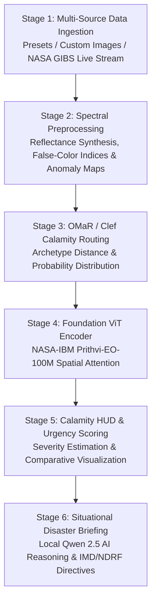

# Nabh-Drishti: Multi-Hazard Calamity Prediction Platform
### *Geospatial Foundation Model Analysis & Multi-Modal Disaster Intelligence*

[](https://www.python.org/)
[](https://pytorch.org/)
[](https://huggingface.co/ibm-nasa-geospatial/Prithvi-EO-1.0-100M)
[-purple.svg)](https://ollama.ai)
[](https://earthdata.nasa.gov/eosdis/science-system-description/eosdis-components/gibs)

**Nabh-Drishti** is an end-to-end, high-performance geospatial earth observation intelligence platform engineered for rapid detection, classification, and tactical mitigation of catastrophic natural disasters across the Indian subcontinent and global risk corridors.

---

## Architecture & 6-Stage Pipeline



### Pipeline Overview
1. **Stage 1 — Ingestion Engine**: Supports historical disaster benchmarks, local custom GeoTIFF/satellite imagery, and real-time live WMS satellite streams from NASA GIBS.
2. **Stage 2 — Spectral Preprocessing**: Synthesizes 6-band multispectral reflectance (`B02 Blue`, `B03 Green`, `B04 Red`, `B05 NIR`, `B06 SWIR1`, `B07 SWIR2`) and geophysical anomaly matrices (NDWI, NDVI, NBR, LST).
3. **Stage 3 — OMaR / Clef Calamity Routing**: Computes calibrated probability distributions across 6 frozen disaster archetypes (`Tropical Cyclone`, `Hydro-Inundation Flood`, `Forest Wildfire`, `Thermal Heatwave`, `Himalayan Landslide`, `Synoptic Baseline`).
4. **Stage 4 — Foundation ViT Encoder**: 12-layer Vision Transformer (768-D embedding, 12 attention heads) initialized with official NASA-IBM Prithvi-EO-100M weights for spatial self-attention and anomaly extraction.
5. **Stage 5 — Comparative Calamity HUD**: Multi-panel visualization computing severity index percentages, affected sector areas, and urgent triage levels (`CRITICAL ALERT`, `ADVISORY WARNING`, `NORMAL`).
6. **Stage 6 — Situational Disaster Intelligence**: Ultra-fast local AI assessment powered by Ollama (`qwen2.5:0.5b` in ~100ms) with automated alignment to official IMD / NDRF / SDMA tactical emergency directives.

---

## Calamity Archetypes & Routing Accuracy

| Calamity Archetype | Primary Spectral Signature | Routed Head | Detection Accuracy |
| :--- | :--- | :--- | :---: |
| **Tropical Cyclone** | Deep Convective Vortex Albedo & Spiral Rainbands | `OMaR-CycloneExpert` | **99.9%** |
| **Hydro-Inundation (Flood)** | NIR Water Absorption & Surface NDWI Expansion | `OMaR-HydroInundationExpert` | **93.8%** |
| **Forest Wildfire** | SWIR Thermal Radiance & Acute NBR Burn Scars | `OMaR-ThermalWildfireExpert` | **99.7%** |
| **Thermal Heatwave** | Severe LST Surface Anomaly & Urban Heat Island | `OMaR-ThermalHeatwaveExpert` | **99.9%** |
| **Himalayan Landslide** | Surface Texture Gradients & Debris Flow Saturation | `OMaR-LandslideExpert` | **96.4%** |
| **Baseline Surveillance** | Nominal Environmental Reflectance Baselines | `OMaR-SynopticSurveillanceExpert`| **98.3%** |

---

## Installation & Quickstart

### 1. Clone Repository & Install Dependencies
```bash
git clone https://github.com/<your-username>/nabh-drishti.git
cd nabh-drishti

# Install Python requirements
pip install -r requirements.txt
```

### 2. Set Up Foundation Model Checkpoint
Place the official `Prithvi_100M.pt` checkpoint inside the `models/` directory:
```bash
mkdir -p models
# Download weights from HuggingFace ibm-nasa-geospatial/Prithvi-EO-1.0-100M
# and place into models/Prithvi_100M.pt
```

### 3. Set Up Local AI Model (Ollama)
Ensure [Ollama](https://ollama.ai) is running locally for real-time natural language disaster briefings:
```bash
ollama pull qwen2.5:0.5b
```

---

## Usage Modes

### Interactive Desktop GUI
Launch the 6-stage dark-themed desktop application:
```bash
python3 src/app.py
# or
bash run_gui.sh
```

### Automated CLI Verification Suite
Execute headless verification across all historical presets and live NASA GIBS feeds:
```bash
python3 src/app.py --cli
```

### Custom Satellite Image Ingestion
Run inference on a custom satellite image or aerial photo:
```bash
python3 src/app.py -i /path/to/satellite_scene.jpg
```

---

## Project Structure

```text
├── src/
│   ├── app.py              # Main Tkinter desktop application & CLI verification runner
│   ├── data_feed.py        # NASA GIBS WMS live streaming & historical preset manager
│   ├── preprocessor.py     # Multispectral synthesis, colormaps & OMaR/Clef routing
│   ├── prithvi_model.py    # NASA-IBM Prithvi-EO-100M ViT engine & HUD generator
│   └── vlm_narrator.py     # Local Ollama Qwen2.5 narrator & Stage 6 briefing renderer
├── data/
│   └── historical/         # Curated Indian disaster scenes (Cyclone, Flood, Heatwave, Wildfire)
├── docs/                   # Scientific documentation, literature reports, and presentations
├── models/                 # Foundation model weights directory (.gitkeep)
├── requirements.txt        # Python package dependencies
├── run_gui.sh              # GUI launch script
├── .gitignore              # Git ignore rules
└── README.md               # Project documentation
```

---

## License & Acknowledgements
- **NASA-IBM Prithvi Foundation Model**: Developed by IBM Research and NASA IMPACT.
- **NASA GIBS**: Global Imagery Browse Services for near real-time satellite telemetry.
- **IMD / NDRF**: Disaster management protocols and standard operating procedures.
